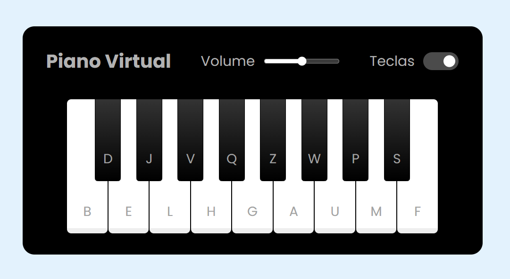

# Simulador de Piano 🎹 
**Uma jornada musical com Javascript!**

Desenvolvido com dedicação durante o Bootcamp da DIO - Front-End do zero, com a orientação do Felipe Aguiar, este projeto representa um marco importante na minha jornada como desenvolvedora.

Esse jogo simples e divertido simula um piano e nele você pode se divertir e se distrair brincando com as músicas.

## Como funciona? 🎼

1. **Clique nas teclas:** Use o mouse para clicar diretamente nas teclas virtuais e ouvir os sons correspondentes.
2. **Toque no teclado:** Utilize as teclas do seu teclado para reproduzir as notas musicais.

## Tecnologias utilizadas 🖥️
- **HTML** para definir as teclas e controles de volume.

- **CSS** para a estilização visual, dando vida ao piano.

- **JavaScript:** Através dele, implementei:
1. _Interatividade:_ As teclas respondem aos clique emitindo os sons.
2. _Controle de volume:_ O slider ajusta o volume do som de forma suave.
3. _Visuais dinâmicos:_ As teclas se animam ao serem pressionadas, proporcionando um feedback visual.
4. _Gerenciamento de eventos:_ O JavaScript escuta os eventos de clique e pressionamento de teclas, desencadeando as ações necessárias.

## Resultado final 🖤

[Clique para vê-lo](https://piano-simulator-liard.vercel.app/)

